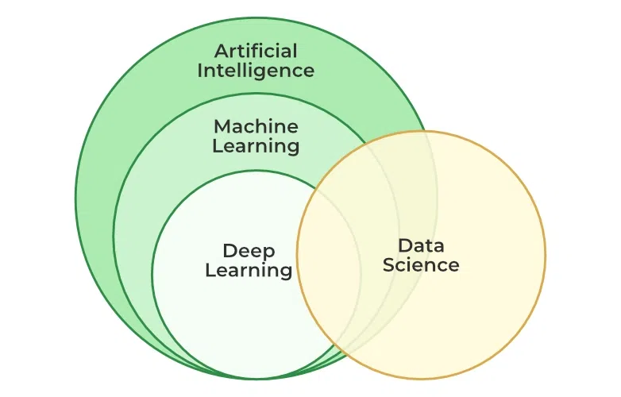

## Artificial Intelligence (AI)
------
**Artificial intelligence(AI)** is the theory and development of computer systems capable of performing tasks that historically required human intelligence, such as recognizing speeech, making decisions, and identifying patterns. \
or \
`smart applications that can perform its own task without any human intervention.`

**Examples:** Robots, Alexa, Self drivinf cars

## Machine Learning (ML)
----
**Machine Learning** is a branch of **AI** thats develops algorithms by learning the hidden patterns of the dataset used it to make predictions on new similar type data, without being explicitly programmed for each task. \
or \
`it provide statstool for visualize, analyze, predective models or forecasting.`

**Examples:** Recommendation System, fraud detection, automated task etc.

### Types of Machine Learning
Some main types of machine learning algorithms are as follows:
1. Supervised Machine Learning
2. Unsupervised Machine Learning
3. 3. Semi-Supervised Machine Learning
4. Reinforcement Learning

.gif)
   

## 1. Supervised Learning
**Supervised learning** is defined as when a model gets trained on a **Labelled Dataset**. Labelled datasets have both input and output parameters. In SL algorithms learn to map points between inputs and correct outputs. it has both training and validation dataset labelled.

**Example**: Consider a scenario where you have to build an image classifier to differentiate between cats and dogs. If you feed the datasets of dogs and cats labelled images to the algorithm, the machine will learn to classify between a dog or a cat from these labeled images. When we input new dog or cat images that it has never seen before, it will use the learned algorithms and predict whether it is a dog or a cat. This is how supervised learning works, and this is particularly an image classification.

### There are two main categories of supervised learning that are mentioned below:
1. Classification - work on categorizal data
2. Regression - work on continuous data
   
## 2. Unsupervised Machine Learning
**Unsupervised Learning** is a type of machine learning technique in which an algorithm discovers patterns and relationships using unlabeled data. Unlike supervised learning, unsupervised learning doesn't involve providing the algorithm with labeled target outputs. The primary goals of unsupervised learning is often to discover hidden patterns, similarities, or clusters within the data, which can then be used for various purposes, such as data exploration, visualization, dimensionality reduction, and more.

**Example**: Consider that you have a dataset that contains information about the purchases you made from the shop. Through clustering, the algorithm can group the same purchasing behavior among you and other customers, which reveals potential customers without predefined labels. This type of information can help businesses get target customers as well as identify outliers.

There are two main categories of unsupervised learning that are mentioned below:

1. Clustering - gropus similar data points into clusters.
2. Dimensionality Reduction - Reduce the dimensionality of data while preserving its essential information.

## 3. Semi-Supervised Learning
**Semi-Supervised** learning is a machine learning algorithm that works between the supervised and unsupervised learning so it uses both **labelled and unlabelled data**. It’s particularly useful when obtaining labeled data is costly, time-consuming, or resource-intensive. This approach is useful when the dataset is expensive and time-consuming. Semi-supervised learning is chosen when labeled data requires skills and relevant resources in order to train or learn from it. Let’s understand it with the help of an example.

## 4. Reinforcement Machine Learning
**Reinforcement machine learning** algorithm is a learning method that interacts with the environment by producing actions and discovering errors. Trial, error, and delay are the most relevant characteristics of reinforcement learning. This methods allows machines to automatically determine the ideal behaviour within specific context in order to maximize performance. This type of learning is crucial for applications that involve decision-making in unpredictable environments. Let’s understand it with the help of examples.

**Example:** Consider that you are training an AI agent to play a game like chess. The agent explores different moves and receives positive or negative feedback based on the outcome. Reinforcement Learning also finds applications in which they learn to perform tasks by interacting with their surroundings.

**Example:** Consider that we are building a language translation model, having labeled translations for every sentence pair can be resources intensive. It allows the models to learn from labeled and unlabeled sentence pairs, making them more accurate. This technique has led to significant improvements in the quality of machine translation services.

## Deep Learning (DL)
-----
**Deep learning** is the branch of machine learning which is based on artificial neural network architecture. An artificial neural network or ANN uses layers of interconnected nodes called neurons that work together to process and learn from the input data.

In a fully connected Deep neural network, there is an input layer and one or more hidden layers connected one after the other. Each neuron receives input from the previous layer neurons or the input layer. The output of one neuron becomes the input to other neurons in the next layer of the network, and this process continues until the final layer produces the output of the network. The layers of the neural network transform the input data through a series of nonlinear transformations, allowing the network to learn complex representations of the input data.

**Examples:** Object detection and recognition, Image classification, Image segmentation etc.

## Data Science (DS)
----
**Data Science** is a concept that brings together ideas, data examination, machine learning, and their related strategies to comprehend and dissect genuine phenomena with data.