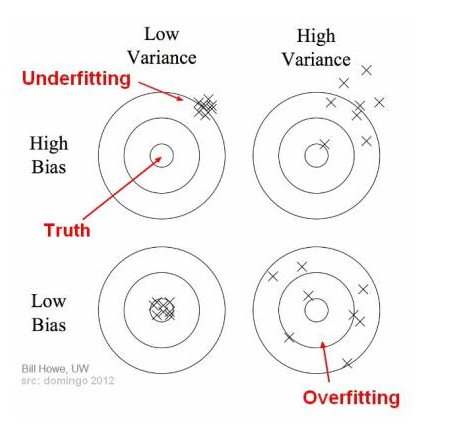
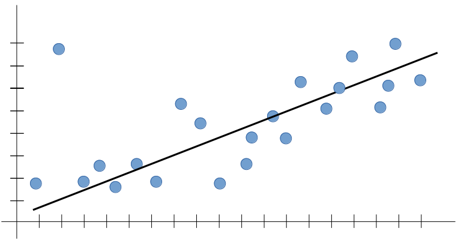
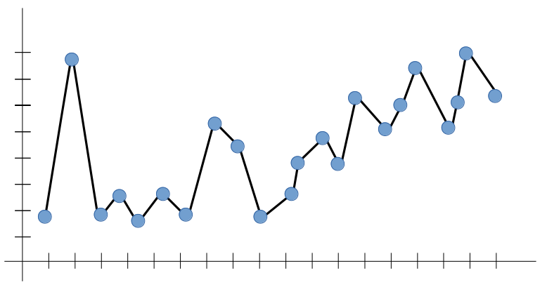

# ML | Underfitting and Overfitting
---

When we talk about machine learning model, we actually talk about how well it perform and its accuracy which is known as prediction error.

## Bais
---
The term bias is the difference between the average predicated value of the model and the actual value of our model which we are trying to predict. \
A model with high bias pays very little attention to the training data and oversimplifies the model.\
Suppose, in case the model with higher error on training and testing data model with high bias.

## Variance
---
Variance is the variability of model prediction for a given data point or a value that tells us that spread of our data. Model with high variance pays a lot of attention to training data and does not generalie on the data which it hasn't seen before. As a result, such models perform very well on training data but have high error rates on test data.

## Underfitting
---
The model contains high bias is simpler than it should be and hence tends to underfit. In other words, model fails to learn on the given data and acquire the intricate pattern of the dataset.

It Means a biased model will not fit on the Training Dataset properly and hence will have low training accuracy (or high training loss).

## Overfitting 
---
A model with high Variance will have a tendency to be overly complex. This causes the overfitting of the model.

Suppose the model with high Variance will have very high training accuracy (or very low training loss), but it will have a low testing accuracy (or a low testing loss). 

Overcomplicating simpler problems: A model with a high variance means the model is overly complex and tries to fit a much more complex curve to a relatively simpler data. The model is thus capable of solving complex problems but incapable of solving simple problems efficiently.

